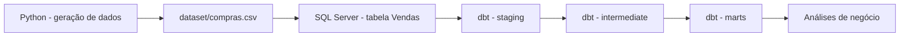

# Projeto de Engenharia de Dados

Este projeto tem como objetivo demonstrar um pipeline completo de dados de vendas, com geração de dados sintéticos, carga para banco relacional e modelagem analítica em dbt.

## Objetivo

Simular um ambiente realista de engenharia de dados em que:

- dados são gerados em Python;
- são salvos em CSV;
- são carregados em um banco SQL Server;
- são transformados e modelados com dbt;
- permitem análises de faturamento, produto, região, vendedor e forma de pagamento.

## Fluxo do projeto



## Estrutura do projeto

```text
.
├── dataset/
│   └── compras.csv
├── dbt_vendas/
│   ├── models/
│   ├── seeds/
│   ├── README.md
│   ├── dbt_project.yml
│   └── target/
├── extract/
│   └── fic_data.py
├── load/
│   └── to_sql.py
├── .env
├── .gitignore
├── main.py
├── README.md
└── logs/
```

## Tecnologias utilizadas

- Python
- Pandas
- SQLAlchemy
- pyodbc
- SQL Server
- dbt
- dotenv

## Pré-requisitos

Antes de executar o projeto, verifique se você possui:

- Python 3.9+
- SQL Server instalado ou acessível
- driver ODBC do SQL Server
- ambiente virtual configurado
- arquivo `.env` com as credenciais do banco

## Configuração do arquivo .env

Crie um arquivo `.env` na raiz do projeto com as seguintes variáveis:

```env
DB_SERVER=SEU_SERVIDOR
DB_DATABASE=SEU_BANCO
DB_DRIVER=ODBC Driver 17 for SQL Server
```

> Importante: o arquivo `.env` não deve ser enviado para o GitHub.

## Como executar

1. Instale as dependências:

```bash
pip install pandas sqlalchemy pyodbc python-dotenv names
```

2. Execute o pipeline completo:

```bash
python main.py
```

Isso irá:

- gerar os dados sintéticos;
- salvar o CSV em `dataset/compras.csv`;
- carregar os registros na tabela `Vendas` do SQL Server.

## Observações importantes

- Este projeto foi pensado como um exemplo de pipeline de dados didático.
- Os dados são gerados sinteticamente, sem uso de informações reais.
- A gestão e a transformação dos dados ficam no diretório `dbt_vendas`.


