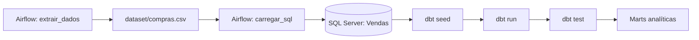

# Projeto de Engenharia de Dados


Pipeline de vendas com geração de dados sintéticos, carga no SQL Server, transformação analítica com dbt e orquestração com Apache Airflow.

## Fluxo do projeto



## Estrutura principal

```text
.
├── apache-airflow/
│   ├── dags/pipeline_vendas.py
│   ├── Dockerfile
│   └── docker-compose.yml
├── dataset/compras.csv
├── dbt_vendas/
│   ├── models/
│   ├── seeds/
│   ├── dbt_project.yml
│   ├── profiles.yml
│   └── target/
├── extract/fic_data.py
├── load/to_sql.py
├── main.py
├── requirements.txt
├── .env.example
└── README.md
```

## Tecnologias

- Python
- Pandas
- SQLAlchemy e pyodbc
- SQL Server
- dbt Core com adapter `dbt-sqlserver`
- Apache Airflow com Docker Compose
- PostgreSQL e Redis para o executor Celery do Airflow

## Pré-requisitos

- Docker Desktop em execução
- SQL Server acessível na máquina ou na rede
- ODBC Driver 18 for SQL Server
- Python 3.10 ou superior para execução local

## Configuração do ambiente

Crie o `.env` a partir do exemplo:

```powershell
Copy-Item .env.example .env
```

Para o Airflow em Docker, use autenticação SQL Server:

```env
DB_SERVER=host.docker.internal
DB_DATABASE=VENDAS
DB_DRIVER=ODBC Driver 18 for SQL Server
DB_USER=seu_usuario_sql
DB_PASSWORD=sua_senha_sql
```

O arquivo `.env` contém credenciais e não deve ser versionado. O `.env.example` é apenas um modelo.

### Autenticação Windows

A execução direta no Windows pode usar Windows Authentication (`Trusted_Connection=yes`). Porém, a DAG executa em containers Linux e não recebe automaticamente o token de autenticação Windows. Para executar a DAG, use um login SQL Server ou configure Kerberos/Active Directory no ambiente Docker.

## Execução local

Instale as dependências da aplicação:

```powershell
python -m pip install -r requirements.txt
```

Execute a extração e a carga:

```powershell
python main.py
```

O comando gera o CSV em `dataset/compras.csv` e carrega os registros na tabela `Vendas`.

## Execução com Airflow

A imagem personalizada do Airflow instala Python 3.12, dbt-sqlserver, dependências Python, Git e ODBC Driver 18. O compose monta o projeto em `/opt/airflow/project` e disponibiliza o profile dbt para a DAG.

Suba a stack a partir da raiz do projeto:

```powershell
docker compose -f apache-airflow/docker-compose.yml up -d --build
```

Abra a interface em [http://localhost:8080](http://localhost:8080). O usuário padrão é `airflow` e a senha padrão é `airflow`, salvo configuração diferente no compose.

Ative a DAG `pipeline_vendas` na interface ou pela linha de comando:

```powershell
docker compose -f apache-airflow/docker-compose.yml exec airflow-worker airflow dags unpause pipeline_vendas
docker compose -f apache-airflow/docker-compose.yml exec airflow-worker airflow dags trigger pipeline_vendas
```

As tasks são executadas nesta ordem:

1. `extrair_dados`: gera os dados e os seeds.
2. `carregar_sql`: carrega `dataset/compras.csv` em `Vendas`.
3. `executar_dbt_seed`: carrega os seeds do dbt.
4. `executar_dbt_run`: executa staging, intermediate e marts.
5. `executar_dbt_test`: executa os testes do dbt.

Para testar uma task isoladamente:

```powershell
docker compose -f apache-airflow/docker-compose.yml exec airflow-worker airflow tasks test pipeline_vendas extrair_dados 2026-09-21
```

## Validação do dbt

```powershell
docker compose -f apache-airflow/docker-compose.yml exec airflow-worker dbt debug --project-dir /opt/airflow/project/dbt_vendas --profiles-dir /opt/airflow/project/dbt_vendas
docker compose -f apache-airflow/docker-compose.yml exec airflow-worker dbt parse --project-dir /opt/airflow/project/dbt_vendas --profiles-dir /opt/airflow/project/dbt_vendas
```

## Parar o ambiente

```powershell
docker compose -f apache-airflow/docker-compose.yml down
```

Os dados de metadados do Airflow ficam no volume Docker `postgres-db-volume`.

## Observações

- O projeto gera dados sintéticos para fins didáticos.
- `dbt_vendas/target` e os logs são artefatos gerados e não devem ser versionados.
- Se a DAG apresentar `ModuleNotFoundError: No module named 'extract'`, os containers antigos ainda estão em execução; recrie-os com `up -d --build`.
- Se aparecer `Falha de logon do usuário ''`, verifique `DB_USER` e `DB_PASSWORD` no `.env` e recrie os containers para recarregar o arquivo.


